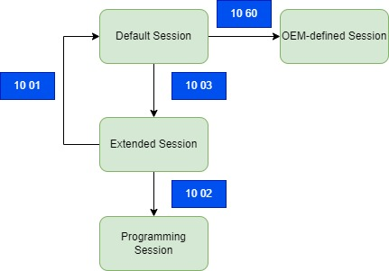

## This is an example of using CANape CASL (Calculation and Scripting Language) to test UDS services
### Test case 1: Verify session transitions

### Test case 2: Verify whether the ECU generated the correct DTC code

